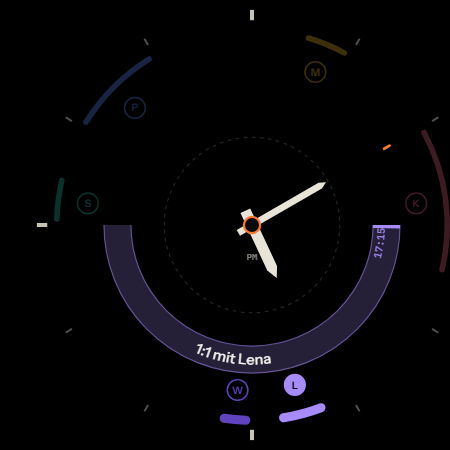

# AgendaDial

Ein Zifferblatt für Galaxy Watch Ultra und Galaxy Watch 5, das den Tag als
Kalender liest statt als Uhrzeit: alle Termine als Marker auf dem Stundenring,
die laufende Stunde als betiteltes Band auf dem Minutenring.



**Die Kurzfassung der Architektur:** Kotlin-Watchfaces sind auf Wear OS 6
plattformseitig blockiert — auch beim Sideload. Watch Face Format ist Pflicht,
kann aber keinen Kalender lesen. Also: ein WFF-Zifferblatt, das einen
bildschirmfüllenden `PHOTO_IMAGE`-Slot rendert, den unser eigener
Complication-Provider in Kotlin zeichnet. Zeiger bleiben nativ im WFF.
Vollständige Herleitung mit Quellen: [docs/ARCHITECTURE.md](docs/ARCHITECTURE.md).

---

## Aufbau

```
design/bench.html      Live-Simulator + Render-Spec. Öffnet im Browser, kein Build nötig.
design/geometry.json   Einzige Quelle der Geometrie. Alles andere wird daraus generiert.

tools/genassets.mjs    -> Zeiger-PNGs
tools/genwff.mjs       -> watchface/src/main/res/raw/watchface.xml
tools/genkotlin.mjs    -> core/.../DialGeometry.kt
tools/genicon.mjs      -> App-Icon: Adaptive Icon + Raster-Fallbacks
tools/shoot.mjs        -> Picker-Preview, Szenario-Screenshots
tools/png.mjs          -> PNG-Writer + analytischer Bogen-Rasterizer

core/                  Geteilter Renderer + Bahnlogik (JVM-testbar)
wear/                  Complication-Provider + Organizer-App          -> APK 1
watchface/             Watch Face Format, per Definition ohne Code    -> APK 2
```

Zwei APKs, weil WFF `android:hasCode="false"` verlangt. Beide gehören auf die Uhr.

---

## Toolchain

Vollständige Anleitung: **[docs/SETUP.md](docs/SETUP.md)** — zugeschnitten auf
Windows 11 mit Alltagskonto ohne Admin-Rechte und separatem Admin-Konto.

Die Kurzfassung, weil genau daran die meiste Zeit verloren geht:

> Das **Admin-Konto installiert nur Binaries**. Das **Alltagskonto macht jede
> Einrichtung** — SDK-Download, Erststart, Builds. Android Studio legt das SDK
> im Profil des Kontos ab, das den Assistenten durchklickt.

Und: das Projekt gehört **nicht** in einen OneDrive-Ordner. Gradle schreibt
zehntausende Dateien nach `build/`; in einem synchronisierten Ordner gibt das
Dateisperren mitten im Build. `C:\dev\AgendaDial` oder ähnlich.

---

## Die drei Iterationsschleifen

Bewusst nach Geschwindigkeit gestaffelt — die meisten Änderungen brauchen nur die erste.

### 1 · Geometrie und Layout — Sekunden, ohne Toolchain

`design/bench.html` im Browser öffnen. Zeit scrubben, Kollisionstag umschalten,
Bahnen einblenden, Ambient testen. Zahlen in `design/geometry.json` ändern,
Seite neu laden. Zustand ist per URL adressierbar:

```
design/bench.html?day=clash&t=17:10&guides=1
design/bench.html?only=dial&t=09:20&day=clash
```

Wenn es hier stimmt, stimmt es auf der Uhr — Bench und Kotlin-Renderer lesen
dieselben Konstanten und rechnen dieselbe Winkelmathematik.

### 2 · Generatoren — eine Sekunde

```bash
node tools/genassets.mjs && node tools/genwff.mjs && node tools/genkotlin.mjs && node tools/genicon.mjs && node tools/shoot.mjs
```

Die CI bricht ab, wenn generierte Dateien nicht zur `geometry.json` passen.

### 3 · Aufs Handgelenk — zwei bis drei Minuten

**Ohne lokalen Build:** pushen, GitHub Actions baut beide APKs und hängt sie als
Artefakt an. Ein Tag `v0.1.0` erzeugt zusätzlich ein Release, aus dem du die
APKs direkt am Handy ziehen und per *Wear Installer* auf die Uhr schieben kannst.

**Mit adb über WLAN** (schneller, sobald einmal gekoppelt):

Auf der Uhr *Einstellungen → Info → Softwareinformationen* → siebenmal auf
Softwareversion tippen, dann *Entwickleroptionen → ADB-Debugging* und
*Debugging über WLAN* aktivieren. Die Uhr zeigt IP und Port.

```bash
adb pair <UHR-IP>:<PAIRING-PORT>
```

```bash
adb connect <UHR-IP>:<PORT>
```

```bash
adb install -r -d watchface/build/outputs/apk/release/watchface-release.apk
```

```bash
adb install -r -d wear/build/outputs/apk/release/wear-release.apk
```

Dann auf der Uhr lange aufs Zifferblatt drücken und **AgendaDial** wählen.

---

## Zuerst prüfen: kommen die Kalenderdaten an?

Das ist das größte Risiko des Projekts, und es kostet 30 Sekunden. Wear OS hat
einen **eigenen** Kalender-Provider — ob dein Arbeitskalender dort landet, hängt
am Sync-Setup der Uhr.

```bash
adb shell content query --uri content://com.android.calendar/calendars --projection _id:account_name:calendar_displayName
```

Kommt nichts oder nur ein leerer lokaler Kalender zurück, brauchen wir Plan B:
eine Companion-App am Handy, die die Agenda über die Wearable Data Layer API auf
die Uhr schiebt. Details in [docs/ARCHITECTURE.md](docs/ARCHITECTURE.md#4).

---

## Status

Grün in der CI ([Runs](https://github.com/krausstt/agenda-dial/actions)):

| Punkt | Status |
|---|---|
| Gradle-Build, beide APKs | **läuft** — AGP 9.3, compileSdk 36 |
| Unit-Tests der Bahnlogik | **grün** — 7 Tests, u. a. Folgetermine vs. echte Überschneidung |
| `watchface.xml` gegen WFF v2 | **valide** — geprüft mit Googles eigenem `wff-validator` |
| Generatoren deterministisch | **grün** — CI bricht bei Drift zu `geometry.json` ab |

Auf Hardware bestätigt (Galaxy Watch Ultra, SM-L705F, One UI 8.0 Watch, API 36):

| Punkt | Status |
|---|---|
| Beide APKs installieren | **läuft** |
| Renderer auf dem Gerät | **läuft** — Indizes, Zeiger, Jetzt-Marke, PM bei 480×480 |
| Kalenderdaten auf der Uhr | **gefunden** — über Samsungs Complication-Provider, inkl. Outlook-Terminen. Der AOSP-Provider ist leer, siehe [ARCHITECTURE.md §4](docs/ARCHITECTURE.md) |

Offen:

| Punkt | Status |
|---|---|
| Termine im Zifferblatt sichtbar | **als Nächstes** — Provider ist angebunden, Build steht aus |
| Complication-Update wirklich minütlich? | **ungeprüft** — `UPDATE_PERIOD_SECONDS=60` ist ein Wunsch, kein Vertrag |
| Ambient-Verhalten des PHOTO_IMAGE-Slots | **ungeprüft** |
| Quick Button der Watch Ultra auf Fremd-App legbar? | **unbelegt** — Samsung-Doku sagt „an app or setting", publizierte Listen nennen nur Samsung-Funktionen |
